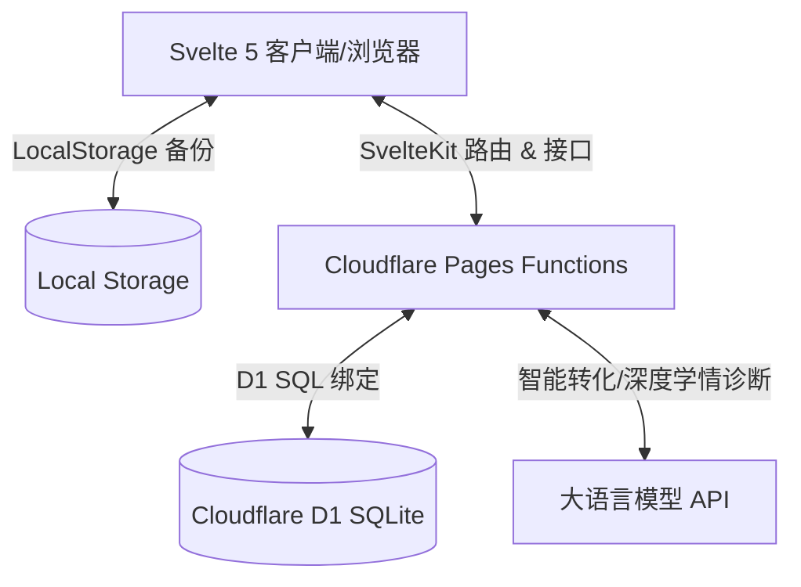

# 🌌 CyberQuiz AI — 智能赛博刷题面板与学情诊断系统

[](https://svelte.dev/)
[](https://kit.svelte.dev/)
[](https://pages.cloudflare.com/)
[](https://developers.cloudflare.com/d1/)
[](https://tailwindcss.com/)

CyberQuiz AI 是一款专为高效刷题和学情诊断设计的现代化 **赛博霓虹深色风** 智能 Web 应用。基于 **Svelte 5** 和 **SvelteKit** 框架开发，全面适配边缘计算架构，能够完美无缝地部署到 Cloudflare Pages 环境，并借助 D1 关系型 SQLite 数据库实现超低延迟的云端数据同步。

---

## ✨ 核心特性

- 🧠 **AI 智能学情分析与复习路径**
  - **赛博诊断室**：对用户的历史练习表现进行多维度扫描，自动诊断强项知识树与薄弱节点，提供个性化的成长级别头衔。
  - **地狱攻坚模式**：针对诊断出的薄弱知识点，提供“一键开启专属错题库练习”的强击杀式复习通道。
  - **个性化时间线路径**：由本地规则引擎或云端大模型结合学情，生成阶段式、任务化的复习突击路线。
  - **API 连通控制中心**：支持在界面中灵活配置大模型 API 密钥、端点和模型，支持一键连通性测试。

- ⚡ **断点续练与状态持久化 (Session Resumption)**
  - **全状态记忆**：实时自动保存当前答题的题号、模式、选项和已提交状态。即便刷新浏览器或退出，也能无损重返。
  - **主页接续快捷通道**：在面板主页动态呈现“继续上次练习”状态栏。点击新练习时，会触发精美的防覆盖警告确认弹窗。
  - **错题本防覆盖拦截**：在错题本点击“重练”时，若当前有未完成的常规练习，会智能弹出确认框，防止用户丢失正在进行的练习进度。

- 📚 **全能错题本与智能消除 (Mistake Elimination)**
  - **多题连贯练习**：在错题本点击“重练”，可根据当前过滤条件（如单选/多选）将对应题集全部打包导入练习，并直接定位到该题，体验连贯的错题消灭流程。
  - **动态错题降频**：基于间隔重复机制，答对错题后其复习频次自动递减。减至 `0` 时动态从队列中剔除，实现丝滑的“降频直至消除”体验。
  - **状态感知返回**：错题全部消灭后，下一题按钮自动切换为“返回（错题已清空）”结算，并智能复原至错题本首页 `/wrong`。

- 📑 **超高兼容性的 Markdown 题库导入**
  - **高级解析器**：支持识别标题式题号、内联难度 `[难度：简单]`、`[知识点：xxx]`、标签元数据、代码块等多种 Markdown 写法。
  - **智能分批转换**：支持前端对超大文档题目进行识别并串行分批请求 API 转换，优雅规避 Cloudflare 的 100秒 超时限制，并支持随时取消转换。
  - **答案与解析提取**：可自动识别文档尾部的 `## 答案卡及解析` 区块，分批导入时智能将其拼接补充以保证 AI 不发生事实性幻觉。

- 📖 **同步知识问答题库 (Knowledge Q&A Curriculum)**
  - **三级学情穿梭**：打造极具仪式感的三级课程检索面板（学期选择 ➔ 学科选择 ➔ 问答真题列表），全面适配七/八/九年级的各主要科目（道德与法治、历史、地理、生物）。
  - **高保真卡片详情**：针对问答题大题，提供标准答案块、结构思维链逻辑网（定性 ➔ 角色 ➔ 批判）以及核心得分词高亮。
  - **三重维度记忆锚点**：智能分解提分秘籍，提供精心编排的**背诵口诀顺口溜**、**生活场景概念映射**以及**常考盲区容易避坑点**。
  - **专属 Markdown/文本录入**：支持在四级页面就地拖拽 `.md` 问答大纲，或一键粘贴 Gemini Gem 等生成的优质内容，实现极速题库扩展与本地秒级响应。
  - **🔐 管理员密码保护删除**：首页右上角内置管理员解锁按钮，输入在 Cloudflare 环境变量 `PASSWORD` 中预设的密码后，可对所有自定义导入的知识问答题目进行删除操作，删除前触发二次确认弹窗；未授权时不展示任何删除入口，保证题库安全不被误删。
  - **导入目标精准锁定**：在特定科目页面触发的导入操作，学期与科目选择器将自动锁定至当前页面对应的分类，防止跨科目误导入。

---

## 🛠️ 系统架构



---

## 🚀 本地开发与启动

请确保您本地已安装 **Node.js** 环境。

1. **克隆仓库并安装依赖**
   ```bash
   git clone https://github.com/demon820308/CyberQuiz-AI.git
   cd CyberQuiz-AI
   npm install
   ```

2. **初始化本地 D1 数据库**
   利用 Wrangler 命令行工具执行 SQL 结构：
   ```bash
   # 为本地测试环境初始化表结构
   npx wrangler d1 execute cyberquiz_db --local --file=./schema.sql
   ```

3. **运行开发服务器**
   ```bash
   npm run dev
   ```
   打开浏览器访问 `http://localhost:5173` 即可开始本地调试。

---

## ☁️ 部署到 Cloudflare 详细步骤

本项目已经完成了 Cloudflare 适配器（`@sveltejs/adapter-cloudflare`）与绑定参数配置，您可以通过以下步骤快速将其发布至云端：

### 第一步：创建 Cloudflare D1 数据库
1. 在本地终端中登录您的 Cloudflare 账号：
   ```bash
   npx wrangler login
   ```
2. 创建一个名为 `cyberquiz_db` 的 D1 数据库实例：
   ```bash
   npx wrangler d1 create cyberquiz_db
   ```
3. 运行成功后，终端将输出类似于下方的配置信息。请将这段信息复制，替换项目根目录下 [wrangler.jsonc](file:///e:/answer/wrangler.jsonc) 文件中的对应部分：
   ```json
   "d1_databases": [
     {
       "binding": "DB",
       "database_name": "cyberquiz_db",
       "database_id": "xxxxxxxx-xxxx-xxxx-xxxx-xxxxxxxxxxxx"  // 替换为您的实际 ID
     }
   ]
   ```

### 第二步：初始化生产环境数据库表结构

> ✨ **全自动零配置建表自愈（推荐）**：
> 本系统已内置了 **D1 数据库全自动初始化与自愈机制**。当您在 Cloudflare Pages 后台成功绑定 D1 数据库并部署完成后，**无需执行任何手动 SQL 命令**，只需在浏览器中打开或刷新网页，后端服务便会自动在云端 D1 中创建所有必要的表结构（`questions`、`wrong_book`、`quiz_history` 和 `session_progress`）。
>
> 如果检测不到绑定的 D1 数据库资源，系统将自动降级为本地 LocalStorage 存储模式运行，不会引发任何报错。

如果您需要通过命令行进行手动初始化或强制重置（可选），请使用以下命令：

> ⚠️ **命令行注意**：Wrangler 执行 `--remote` 时会读取 `wrangler.jsonc` 配置文件中的 `database_id`。如果您的本地 `wrangler.jsonc` 中的 `database_id` 仍为默认占位符 `"local-db-binding"`，直接执行可能会报错 `Invalid property: databaseId => Invalid uuid`。
> 
> **请任选以下一种方法解决并执行命令行初始化：**

#### 方法 A：直接通过云端数据库 UUID 导入
1. 运行以下命令查看您刚才创建的数据库的真实 `UUID`（即 `Database ID`）：
   ```bash
   npx wrangler d1 list
   ```
2. 复制 `cyberquiz_db` 的 UUID，并将其替换到下方命令中运行：
   ```bash
   npx wrangler d1 execute <您的-UUID> --remote --file=./schema.sql
   ```

#### 方法 B：更新配置文件后导入
1. 将刚才创建数据库时输出的真实 `database_id` UUID 更新到项目根目录下的 `wrangler.jsonc` 文件中。
2. 直接运行数据库名称进行导入：
   ```bash
   npx wrangler d1 execute cyberquiz_db --remote --file=./schema.sql
   ```

### 第三步：在 Cloudflare 控制台部署项目

我们强烈推荐使用 **GitHub 持续集成 (Git Integration)** 的方式进行部署：

1. **推送代码到您的 GitHub 仓库**：
   ```bash
   git add .
   git commit -m "feat: 适配 Cloudflare Pages 部署规范"
   git push origin main
   ```
2. **在 Cloudflare Dashboard 中创建 Pages 项目**：
   - 登录 [Cloudflare 控制台](https://dash.cloudflare.com/)，导航至 `Workers & Pages` -> `Create` -> `Pages` -> `Connect to Git`。
   - 选择您存放本项目的 GitHub 仓库 `CyberQuiz-AI`。
3. **配置构建设置**：
   - **Framework preset (框架预设)**：选择 `SvelteKit`。
   - **Build command (构建命令)**：输入 `npm run build`。
   - **Build output directory (构建输出目录)**：输入 `.svelte-kit/cloudflare`。
   - **Compatibility date (兼容性日期)**：输入 `2026-05-22`。
4. **绑定 D1 数据库**：
   - 项目创建成功后，在 Pages 项目详情页中，导航到 `Settings (设置)` -> `Functions (函数)`。
   - 找到 `D1 database bindings (D1 数据库绑定)` 区域，点击 `Add binding`。
   - **Variable name (变量名)** 必须填：`DB`。
   - **D1 database** 选择您之前创建的 `cyberquiz_db`。
   - 点击保存。
5. **设置管理员删除密码（必须）**：
   - 在同一 Pages 项目详情页，导航到 `Settings (设置)` -> `Environment variables (环境变量)`。
   - 点击 `Add variable`，按如下填写：
     - **Variable name (变量名)**：`PASSWORD`
     - **Value (值)**：您自定义的管理员密码（建议包含大小写字母与数字）
   - 点击保存。设置后，首页右上角的管理员🔐按钮将使用该密码进行身份核验，只有输入正确密码后才能对知识问答题目执行删除操作。

   > ⚠️ **安全提示**：如不设置 `PASSWORD` 环境变量，系统将回退使用内置默认密码 `admin`。建议所有生产环境务必自行配置此变量。

6. **重新构建发布**：
   - 返回 `Deployments (部署)` 页面，点击最新的部署记录右侧的三个点，选择 `Retry deployment`。
   - 构建完成后，Cloudflare 将为您生成一个专有的 `*.pages.dev` 访问域名，至此部署成功！

---

## 📝 题库格式编写标准
如果您需要手动编写或转换本地 Markdown 试题导入到本系统中，请参照 [template.md](file:///e:/answer/items/template.md) 模板规范。
我们同时提供了一份面向 AI 的全自动格式化 [Prompt 指南](file:///e:/answer/items/prompt_generate_quiz.md)，帮助您使用大语言模型一键处理杂乱试题。

## 📄 开源协议
本项目采用 [MIT License](LICENSE) 许可协议。
